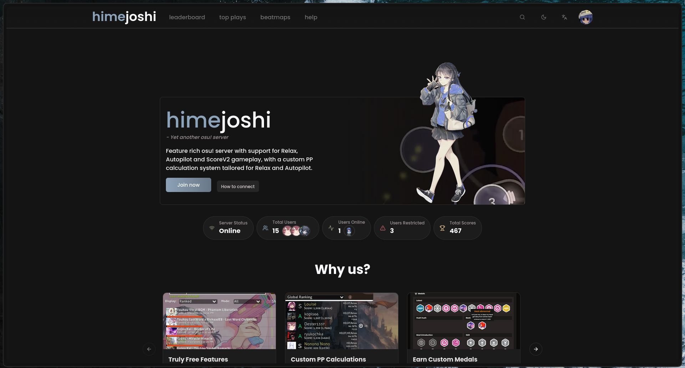

<p align="center">
  
</p>

[](https://opensource.org/licenses/MIT)
[](https://github.com/himejoshi-gay/Moonlight)

## Description

Moonlight is a part of the Himejoshi ecosystem, which aims to create a fully functional osu! private server with all the features that the official server has. This project is made with TypeScript and Next.js.

## 🖼️ Preview 



## Installation (via the nix flake) ❄️
1. Clone the repository
2. Create a copy of `.env.local.example` file as `.env.local` and fill all required fields
3. Run the following command:
```bash
nix develop # Installs dependencies and starts the dev server
```
4. The site should be available at: http://localhost:3000/

## Using docker 🐳
Same as above, except run
```bash
docker compose -f docker-compose.yml up -d # Creates the container with app and all dependencies
```
The site should then be available at: http://localhost:3090/

## Manually 📩

1. Clone the repository
2. Install the required dependencies: `npm install`
3. Create a copy of `.env.local.example` file as `.env.local` and fill all required fields
4. Start the application: `npm run build` and `npm run start`

> [!NOTE]
> If you are hosting [Moonlight](https://github.com/himejoshi-gay/Moonlight) **locally** (without domain system), add:
> ```bash
> NODE_TLS_REJECT_UNAUTHORIZED=0
> ```
> to your `.env.local` file. 


## Contributing 💖

If you want to contribute to the project, feel free to fork the repository and submit a pull request. We are open to any
suggestions and improvements.

## License

This project is licensed under the MIT License. See the [LICENSE](../LICENSE) file for more details.
